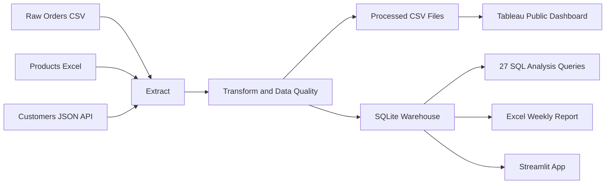

# E-Commerce Data Pipeline & Analytics Dashboard

End-to-end data analytics project that transforms raw e-commerce transactions into a cleaned warehouse, SQL insights, Excel reporting, Tableau dashboards, and a deployment-ready analytics app structure.


## Quick Links

| Resource | Link |
|---|---|
| Tableau Dashboard | [View Tableau Public Dashboard](https://public.tableau.com/views/E-CommerceDataPipelineAnalyticsDashboard/ExecutiveOverview?:language=en-US&publish=yes&:sid=&:redirect=auth&:display_count=n&:origin=viz_share_link) |
| Streamlit App | [Streamlit App](https://ecommerce-data-pipeline-dashboard-xxazquwm5hknr2eju86wbr.streamlit.app/) |

>Start with the Tableau dashboard. It includes Executive Overview, Customer Intelligence, and Product Performance views built from the cleaned pipeline outputs.

## Business Problem

A mid-size e-commerce business has sales transactions, product metadata, and customer attributes spread across CSV, Excel, and API-style JSON sources. The business needs a reliable analytics pipeline to answer revenue, customer, product, return-risk, and pricing questions. This project builds the full workflow from raw data generation and ETL to SQL analysis, Excel reporting, and Tableau storytelling.

## Architecture



## Key Results

- Processed 60,000 raw transaction rows through the ETL pipeline.
- Produced 53,813 clean order rows after validation and cleaning.
- Loaded 68,806 warehouse rows into SQLite across dimensions and fact tables.
- Generated 27 SQL analysis queries covering revenue, RFM, products, cohorts, pricing, returns, and city tiers.
- Built a Tableau Public dashboard with 3 views: Executive Overview, Customer Intelligence, and Product Performance.
- Generated an automated Excel report with 5 sheets and an embedded revenue chart.
- Achieved an order data quality score of 89.69% with detailed rejection tracking.

## Tech Stack

| Layer | Tools | Purpose |
|---|---|---|
| Data Sources | CSV, Excel, JSON | Orders, product catalog, customer API simulation |
| Data Generation | Faker, pandas, numpy | Synthetic fallback dataset and mock customer/product sources |
| ETL | Python, pandas | Extraction, cleaning, enrichment, validation |
| Database | SQLite, PostgreSQL-ready SQLAlchemy layer | Local warehouse and deployment-friendly storage |
| SQL Analysis | CTEs, joins, aggregations, window functions | Business KPI and deep-dive analysis |
| Reporting | openpyxl | Automated weekly Excel report |
| Visualization | Tableau Public | Published business dashboards |
| Notebook | Jupyter | Kaggle-ready analysis narrative |
| App | Streamlit, Plotly | Interactive project viewer with SQL, charts, ETL status, and downloads |

## Project Structure

```text
ecommerce-pipeline/
├── app/
│   ├── tabs/
│   └── utils/
├── data/
│   ├── raw/
│   ├── processed/
│   └── database/
├── etl/
│   ├── extract.py
│   ├── transform.py
│   ├── load.py
│   ├── pipeline.py
│   └── logger.py
├── notebooks/
│   └── full_analysis.ipynb
├── reports/
│   ├── excel_generator.py
│   └── weekly_report_2026-06-22.xlsx
├── scripts/
│   └── generate_mock_data.py
├── sql/
│   ├── analysis/
│   ├── kpis/
│   └── schema/
├── config.py
├── requirements.txt
└── README.md
```

## How To Run Locally

Clone or open the project folder, then install dependencies:

```powershell
cd C:\Users\LENOVO\Desktop\ecommerce-pipeline
python -m pip install -r requirements.txt
```

Generate raw fallback data if needed:

```powershell
python scripts\generate_mock_data.py
```

Run the full ETL pipeline:

```powershell
python -m etl.pipeline
```

Generate the Excel report:

```powershell
python reports\excel_generator.py
```

Open the notebook:

```powershell
jupyter notebook notebooks\full_analysis.ipynb
```

Run the Streamlit app locally:

```powershell
python -m streamlit run app/app.py
```

## SQL Analysis Layer

The project includes 27 SQL queries across 7 analysis files:

| File | Focus |
|---|---|
| `01_revenue_analysis.sql` | Monthly revenue, country revenue, quarterly comparison, running totals |
| `02_customer_rfm.sql` | RFM segmentation, Pareto customers, churn risk, new vs returning customers |
| `03_product_performance.sql` | Top products, category margin, return rate, market basket, slow inventory |
| `04_cohort_retention.sql` | Monthly retention matrix, purchase gaps, cohort AOV |
| `05_dark_pattern_detection.sql` | Pre-sale price inflation, price volatility, frequent price changes |
| `06_return_fraud_analysis.sql` | High return-rate customers, quick returns, high-value return clusters |
| `07_city_tier_analysis.sql` | Revenue, AOV, repeat rate, churn risk, category preference by city tier |

## Key SQL Highlights

RFM segmentation:

```sql
NTILE(5) OVER (ORDER BY recency_days DESC) AS r_score,
NTILE(5) OVER (ORDER BY frequency ASC) AS f_score,
NTILE(5) OVER (ORDER BY monetary ASC) AS m_score
```

Month-over-month revenue growth:

```sql
ROUND(
    100.0 * (revenue - LAG(revenue) OVER (ORDER BY year, month))
    / NULLIF(LAG(revenue) OVER (ORDER BY year, month), 0),
    2
) AS mom_growth_pct
```

Market basket product pairs:

```sql
JOIN fact_orders o2
  ON o1.invoice_no = o2.invoice_no
 AND o1.product_id < o2.product_id
```

## Tableau Dashboard

Published Tableau Public dashboard:

[View E-Commerce Data Pipeline Analytics Dashboard](https://public.tableau.com/views/E-CommerceDataPipelineAnalyticsDashboard/ExecutiveOverview?:language=en-US&publish=yes&:sid=&:redirect=auth&:display_count=n&:origin=viz_share_link)

Dashboard views:

- Executive Overview: revenue, orders, customers, AOV, profit margin, revenue by country, monthly revenue trend.
- Customer Intelligence: customer segmentation, loyalty/city-tier behavior, customer value patterns.
- Product Performance: top products, category performance, product-level business insights.

## Excel Report

The automated report is generated by:

```text
reports/excel_generator.py
```

It creates:

- Executive Summary
- Revenue Breakdown
- Customer Segments
- Product Performance
- Alerts & Flags

Sample output:

```text
reports/weekly_report_2026-06-22.xlsx
```

## Business Insights

- Revenue is highly concentrated in the United Kingdom, making country-level performance monitoring important.
- Customer segmentation enables targeted retention campaigns for high-value and at-risk customers.
- Product and category analysis identifies top revenue drivers and categories with strong margin potential.
- Return tracking separates cancellations and negative quantities into a dedicated returns fact table for risk analysis.
- Data quality reporting makes the pipeline auditable by tracking null customer IDs, invalid quantities, invalid prices, duplicates, and cancellations.

## Current Status

| Component | Status |
|---|---|
| Folder structure | Complete |
| Requirements and config | Complete |
| Data generation | Complete |
| Extract stage | Complete |
| Transform stage | Complete |
| Load stage and pipeline orchestration | Complete |
| SQL analysis queries | Complete |
| Excel report automation | Complete |
| Jupyter notebook | Complete |
| Tableau Public dashboard | Complete |
| Streamlit app | Complete locally |

## Author

Mohith Kumar M P  
B.E. AI & Data Science Graduate

